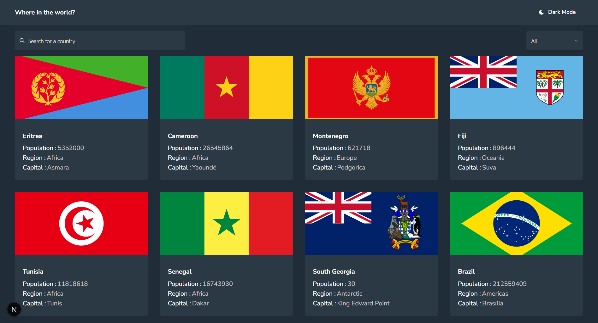

# Frontend Mentor - REST Countries API with color theme switcher solution

This is a solution to the [REST Countries API with color theme switcher challenge on Frontend Mentor](https://www.frontendmentor.io/challenges/rest-countries-api-with-color-theme-switcher-5cacc469fec04111f7b848ca). Frontend Mentor challenges help you improve your coding skills by building realistic projects.

- [Overview](#overview)
  - [The challenge](#the-challenge)
  - [Screenshot](#screenshot)
  - [Links](#links)
- [My process](#my-process)
  - [Built with](#built-with)
  - [What I learned](#what-i-learned)
- [Author](#author)
- [Acknowledgments](#acknowledgments)

## Overview

### The challenge

Users should be able to:

- See all countries from the API on the homepage
- Search for a country using an `input` field
- Filter countries by region
- Click on a country to see more detailed information on a separate page
- Click through to the border countries on the detail page
- Toggle the color scheme between light and dark mode _(optional)_

### Screenshot

### Links

- Solution URL: https://github.com/Fanu-Cd/frontend-mentor-rest-countries-api-with-color-theme-switcher
- Live Site URL: '-'

### My process

### Built with

- Semantic HTML5 markup
- CSS custom properties
- Flexbox
- CSS Grid-HTM
- Mobile-first workflow
- [React](https://reactjs.org/) - JS library
- [Next.js](https://nextjs.org/) - React framework
- [Tanstack React Query](https://tanstack.com/query/latest) - Library for better data fetching
- [Tailwindcss](https://tailwindcss.com/) - CSS Framework
- [Mantine UI](https://mantine.dev/) - UI Library
- [Tabler Icons](https://tabler.io/icons) - React Icons Library
- [Vite](https://vite.dev/) - Build tool

### What I learned

What I Learned While I Implemented the ecommerce product page

- Used Mantine UI to build accessible and responsive components
- Styled the app efficiently using Tailwind CSS utility classes
- Fetched and cached data using React Query
- Parsed and displayed real-world data from the REST Countries API
- Implemented light/dark mode toggle for better UX
- Built a responsive layout adaptable to all screen sizes
- Handled search, filter, and detail views with proper state management and debounced inputs for better input management (using use-debounce library)

## Author

- Website - [Fanuel Amare](http://fanuel-amare-personal-portfolio-v2.vercel.app/)
- Frontend Mentor - [@Fanu-Cd](https://www.frontendmentor.io/profile/Fanu-Cd)
